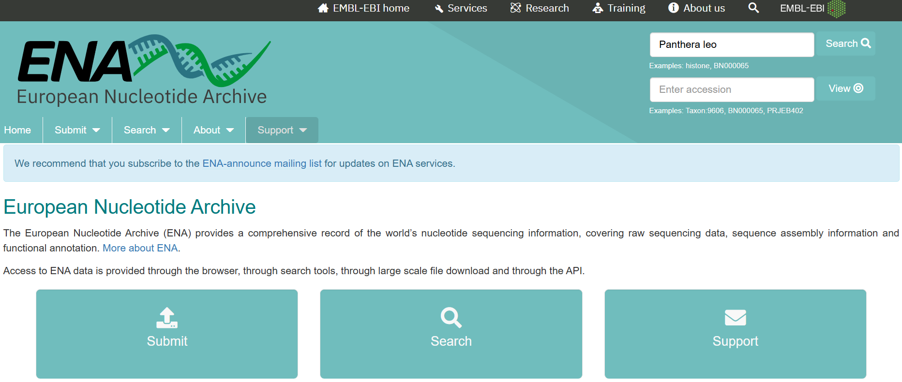
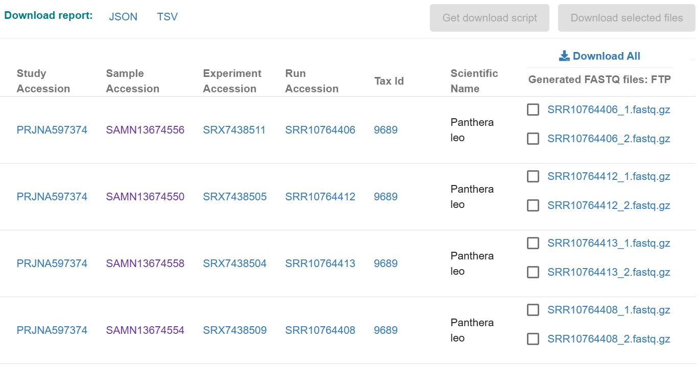
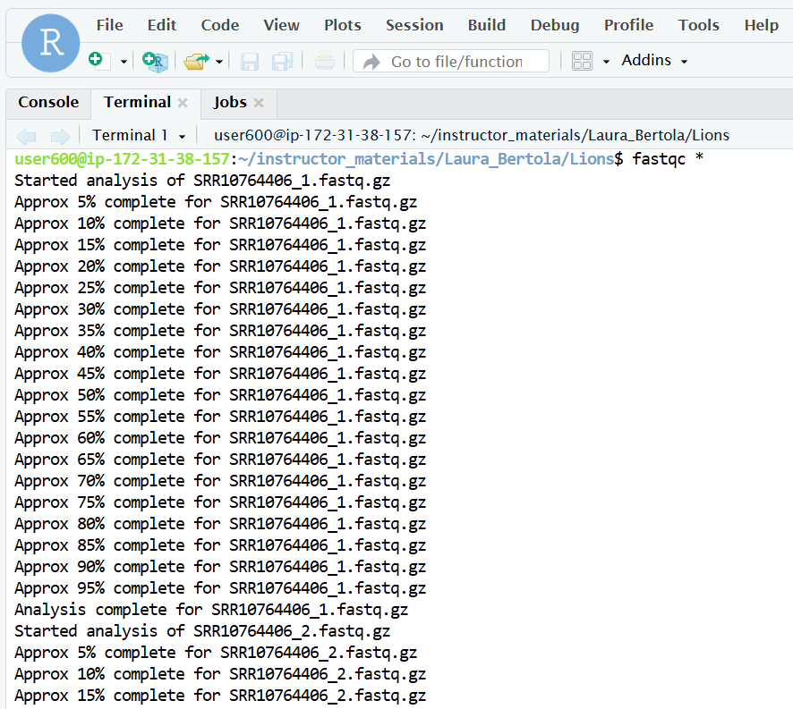
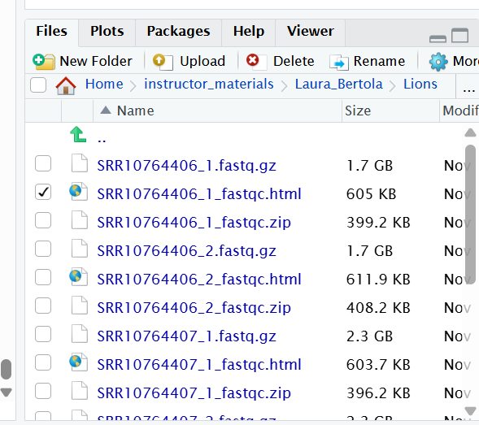
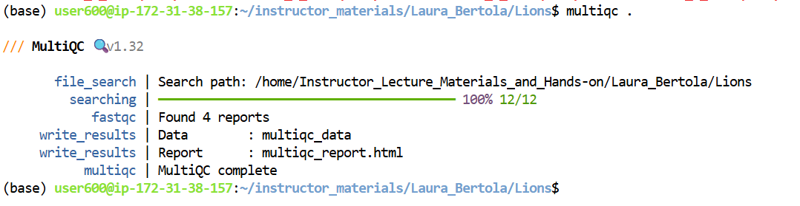
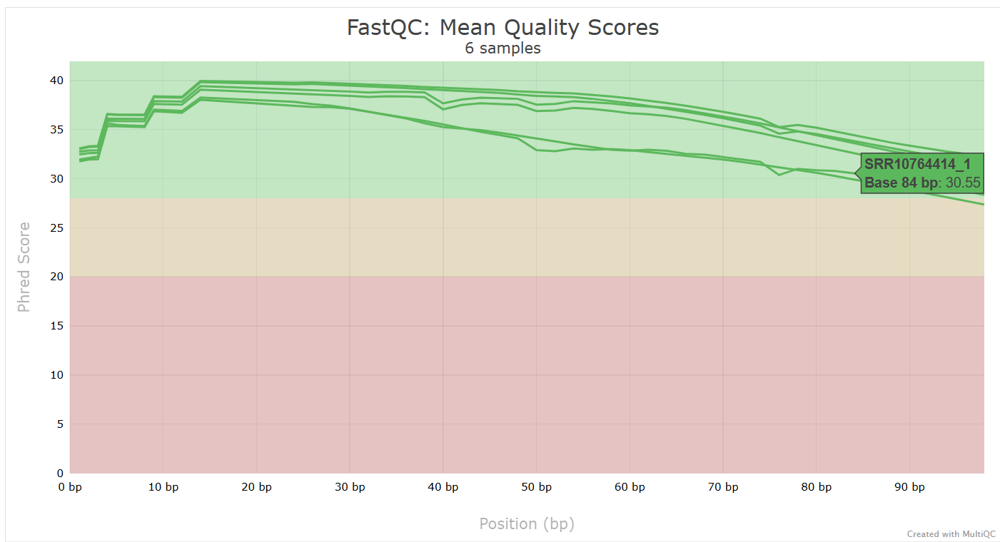
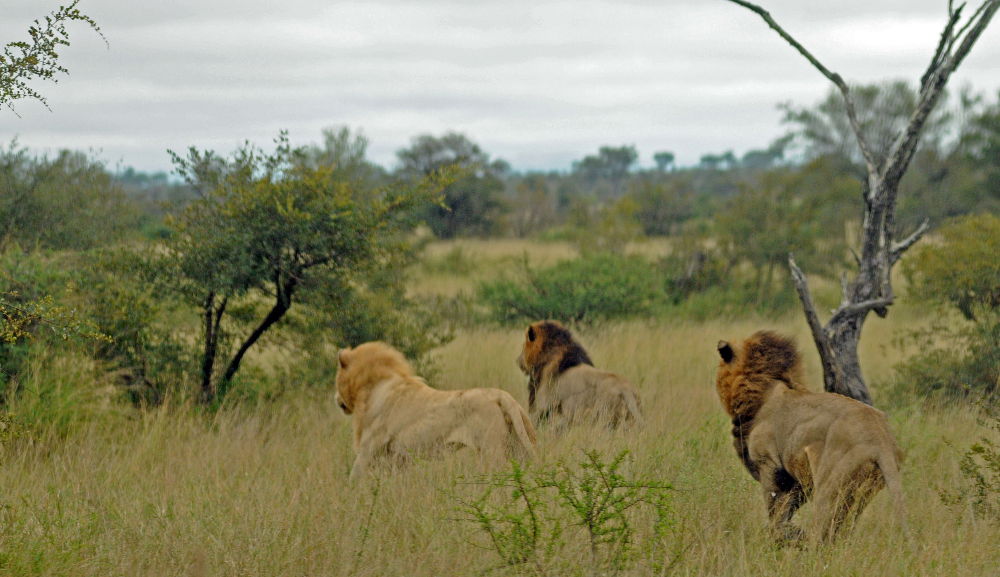

# Genomic data, the fastq format and basic quality control
Here, we will familiarize ourselves with genomic data, typically arriving in the `fastq` format. We will run some analysis which allow us to get an idea of the quality of the data and to see if we need to do any pre-processing before moving on to the next step, like mapping the data to a reference genome.
This section will use data from lions from [Bertola et al. (2022)](https://bmcgenomics.biomedcentral.com/articles/10.1186/s12864-022-08510-y). And below is a young lion I met on my last trip to Kruger, a few years ago.

:camera: Lion in Kruger NP, South Africa  
  
©Laura Bertola

## Raw data
Let's start with making a folder in which you will be working today:
```
mkdir Lions
cd Lions
```

Imagine you're doing a project on lions and would like to include some previously published data in your analyses. For example, because it allows you to compare your population to other populations elsewhere in Africa or India. You may want to check [NCBI](https://www.ncbi.nlm.nih.gov/) or [ENA](https://www.ebi.ac.uk/ena/browser/home) if they have anything interesting online.

Let's go to the ENA Browser, using the link above, and fill out "Panthera leo" in the search box.



You'll get a lot of information, about available assemblies, sequences, projects etc. For this exercise, we will look at some specific lion genomes, so first click on "Study" in the left column, then navigate to the second page, and find this:


Once you click on it, you'll see all sequencing runs from this project.



Because it will take too much time to download and analyze all, we will focus on the following two:  
SAMN13674556 (Zambia)  
SAMN13674549 (Benin)  

You'll see that for each sample there are two files ending with _1.fastq.gz and _2.fastq.gz. Most of the time, you'll be working with paired-end data, meaning that each sample has two files. These are usually identified by _R1 and _R2, or, like in this case, _1 and _2. Those two files contain the forward and reverse reads, respectively. We want to download these 4 files, but you'd like to get them onto the server directly, not download them to your computer first. There is an easy way to do that: check the boxes for each file you'd like to download, then click on "Get download script" at the top. It should show you the following:

```
wget -nc ftp://ftp.sra.ebi.ac.uk/vol1/fastq/SRR107/006/SRR10764406/SRR10764406_1.fastq.gz
wget -nc ftp://ftp.sra.ebi.ac.uk/vol1/fastq/SRR107/006/SRR10764406/SRR10764406_2.fastq.gz
wget -nc ftp://ftp.sra.ebi.ac.uk/vol1/fastq/SRR107/014/SRR10764414/SRR10764414_1.fastq.gz
wget -nc ftp://ftp.sra.ebi.ac.uk/vol1/fastq/SRR107/014/SRR10764414/SRR10764414_2.fastq.gz
```

Copy-paste this into your terminal. If the download takes a while, we can watch this short video about Illumina sequencing in the meantime: [video](https://www.youtube.com/watch?v=fCd6B5HRaZ8)

>**Note:** If you want to download from NCBI directly, it's better to use `sra-tools`. Here, we bypass this and use `wget` to get the data directly from ENA.

Now, the raw data are there and we can take a look at one of the files.

Type the following command:
```
zcat SRR10764406_1.fastq.gz | less -S
```

The `zcat` command is used to unzip the file (note it ends with .gz), and `less` allows you to view it. Here we add `-S` to chop off long lines. Otherwise it wraps around and becomes messy. Try scrolling right and down, using the arrow keys. To quit `less` type q. 

Each sequenced read is spread over four lines, one of which contains the sequence data and another contains the quality scores stored as ASCII characters. The other two lines are used as headers to store information about the read.
It'll look something like this:


The first is the name of the read, with information about its location on the plate, or in this case the identifier from NCBI/ENA, where the data were downloaded from (see more details in the table below). The second line contains the sequence data. The third line is unused (identified with +). And the fourth line is the quality scores for the base calls. The [FASTQ wikipedia page](https://en.wikipedia.org/wiki/FASTQ_format) has a good figure depicting the logic behind how quality scores are encoded.

| Component          | Meaning                                      |
|--------------------|----------------------------------------------|
| SRR10764406.701      | SRA run ID + internal read index             |
| D7MHBFN1           | Illumina sequencing instrument ID            |
| 228                | Run number on that instrument                |
| C1V86ACXX          | Flowcell ID                                  |
| 8                  | Lane number                                  |
| 1101               | Tile number within the lane                  |
| 6387:2398          | X:Y coordinates of the cluster on the tile   |
| /1                 | Read 1 of a paired-end sequencing run        |

If you'd like to see the messy format, with long lines wrapping, try using `head -n 20` instead of the `less` command. `head` shows the first part of the file, and `-n 20` tells it to show the first 20 lines. 
If you're really brave, try just using `zcat`, without `less` and see what happens. Press `CTRL+C` to escape the madness.

>**Note:** `CTRL+C` is a very useful thing to know. This will allow you to interrupt whatever is running. Just remember, because it interrupts the process, it will probably create a problem with your output files because they are then truncated or otherwise corrupted.  


## FastQC 

The first step is to inspect your raw data to estimate overall quality. Scrolling through the data with `less` is obviously not going to work for this. So, we'll use a software called [FastQC](https://www.bioinformatics.babraham.ac.uk/projects/fastqc/) to help us visualize overall data quality for each of our files. You can then attempt to improve your dataset by identifying and removing samples with failed sequencing. 

Let's start the run now. Make sure that you're in the folder with the fastq.gz files, then run the `fastqc` command.
```
fastqc *
```

On the screen, you'll see the progress of your FastQC run. 
 

>**Note:** we use *, which is a wildcard. It means *any file in your directory*. You can use wildcards also more specifically, for example `*.fastq.gz`, which means all fastq.gz files. Or `*_1*`, which is all files with _1 anywhere in their name, which comes in handy if you only want to process forward reads, for example.

Another key QC procedure involves inspecting average quality scores per base position and trimming read edges, which is where low quality base-calls tend to accumulate. In this figure, the X-axis shows the position on the read in base-pairs and the Y-axis depicts information about [Phred quality score](https://en.wikipedia.org/wiki/Phred_quality_score) per base for all reads, including median (center red line), IQR (yellow box), and 10%-90% (whiskers). As an example, here is a very clean base sequence quality report for a 75bp library. These reads have generally high quality across their entire length, with only a slight (barely worth mentioning) dip toward the end of the reads:


In contrast, here is a somewhat typical base sequence quality report for R1 of a 300bp paired-end Illumina run of another dataset:


This figure depicts a common artifact of current Illumina chemistry, whereby quality scores per base drop off precipitously toward the ends of reads, with the effect being magnified for read lengths >150bp. The purpose of using FastQC to examine reads is to determine whether and how much to trim our reads to reduce sequencing error interfering with basecalling. In the above figure, as in most real dataset, we can see there is a tradeoff between throwing out data to increase overall quality by trimming for shorter length, and retaining data to increase value obtained from sequencing with the result of increasing noise toward the ends of reads.

When everything is done, see what files were created with `ls`. 
You'll see that for each input file, FastQC created an .html and a .zip file. You want to look into the html file, which contains all the information you need for now. 

In this system, you can download (and upload!) files from the pane in the lower right hand corner with all folders and files. 



Navigate to your folder with the FastQC output and select the files you'd like to download to your computer, select the files, then "More" and "Export". For now, we'll only look at the the two files with the forward reads. After downloading, open them in your browser. You'll see plots like the one above. On the left side there is a summary of the results, highlighting those sections which require your attention. Is there anything in our data we should be concerned about?


Often, you'll have a large number of samples, and you don't want to waste time looking at tons of individual html files. [MultiQC](https://docs.seqera.io/multiqc) can help you summarize the results of multiple fastqc files. Unfortunately, MultiQC needs another python version than the one which is installed system wide. We need to first activate an environment which allows MultiQC to run properly. Run the following lines:

```
conda activate
multiqc .
```



Look at the html file (download it to your computer, just like you did with the previous html files). It shows the results of all FastQC results in the same report. Note that the sample name appears when you hover with your cursor over a plot, so it is easy to identify which samples look strange and may require some more attention. 



After we're done, deactivate the environment:
```
conda deactivate
```

:camera: White lion "Caspar" with two of his brothers, hunting buffalo in Kruger NP, South Africa
  
©Laura Bertola
