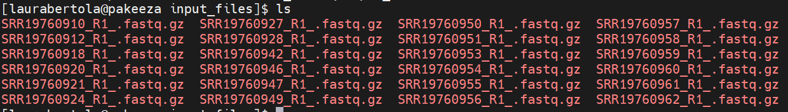
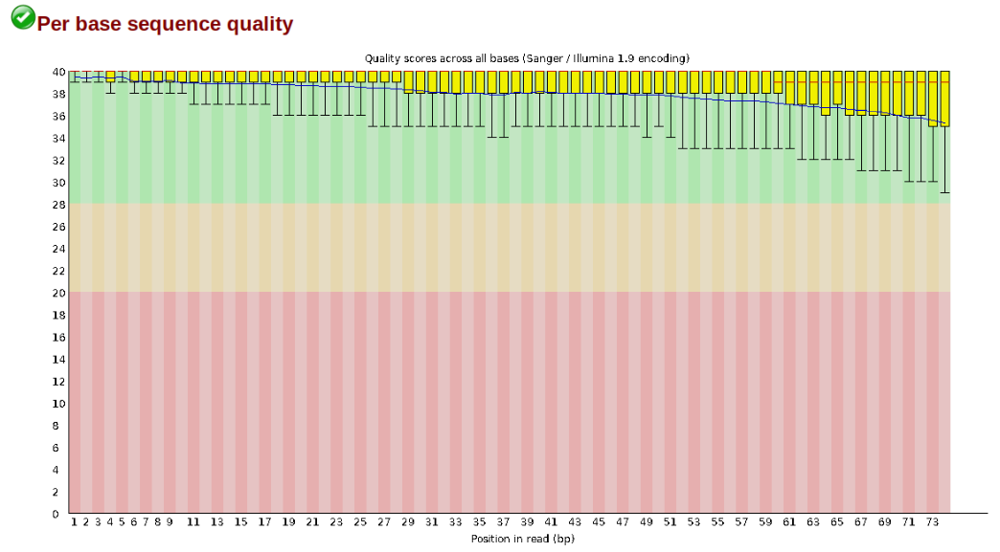
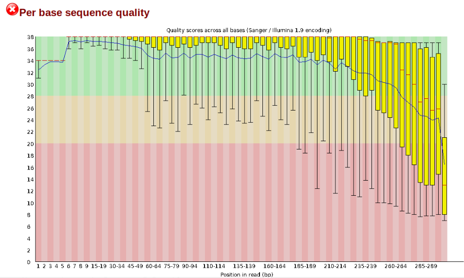
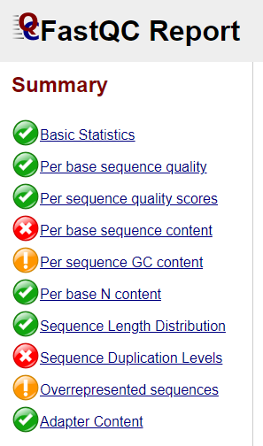
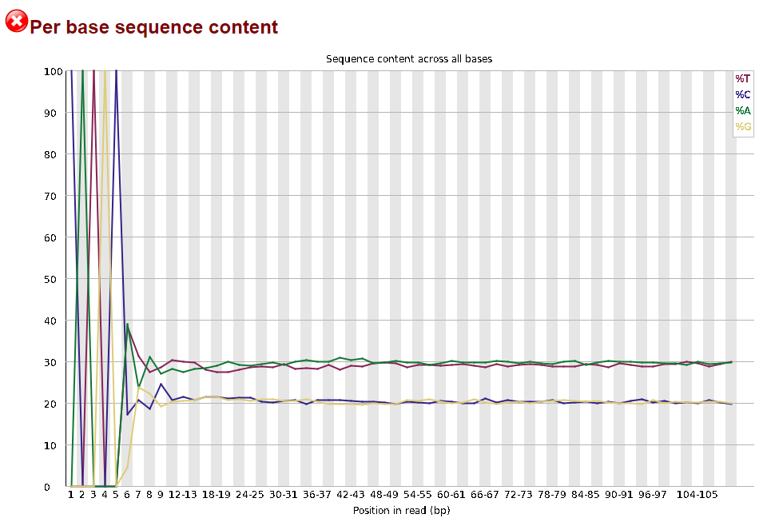
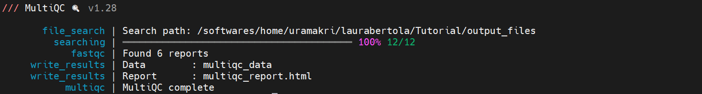

## Raw data

We will be reanalysing RAD-Seq data from cheetahs (*Acinonyx jubatus*) sampled from across their distribution in Africa and Iran and published in [Prost *et al.* 2022](https://onlinelibrary.wiley.com/doi/10.1111/mec.16577). The study used various datatypes, including whole genome sequencing (WGS), mitochondrial data, MHC data, minisatellites and RADseq data. For this workshop, we will focus only on (part of ) the RADseq data, which consists of 23 individuals from 6 populations, and one outgroup (puma; *Puma concolor*). The data were generated using a double-digest restriction-site associated DNA (ddRAD) sequencing approach [Peterson *et al.*, 2012](https://journals.plos.org/plosone/article?id=10.1371/journal.pone.0037135). Note that raw reads have been randomly downsampled to 125,000 reads per sample, in order to create a dataset that will be computationally tractable with the expectation of finishing in a reasonable time. 

To keep things organized, first make a folder in your directory for this Tutorial, using `mkdir`, check if it is there with `ls`, and then go to the newly created folder, using `cd`.
```
mkdir Tutorial_RADseq
```
```
ls
```
```
cd Tutorial_RADseq
```

The downsampled cheetah data are in my input_files folder. So, now create a symbolic link to my folder by doing the following:
```
ln -s /home/uramakri/laurabertola/Tutorial_RADseq/input_files input_files
```

You should now have something which *looks* like a folder, called input_files, in your directory, but actually it teleports you to *my* folder when you enter it.

If you do `ls` now, you'll see the files of the individual samples:


>**Note:** You'll see that every file contains `_R1_`. Most of the time, the data you will be working on are paired-end, meaning that each sample has a `_R1_` and `_R2_` file. For this workshop, and to ensure that the steps run quickly, we will only use `_R1_`. 

Before we get started with the assembly, let's take a look at what the raw data looks like. We can use `zcat` and `head` to do this.

Here we have our first look at a fastq formatted file. Each sequenced read is spread over four lines, one of which contains sequence and another the quality scores stored as ASCII characters. The other two lines are used as headers to store information about the read.
```
zcat subset-R1-raws/SRR19760910_R1_.fastq.gz | head -n 20
```


The first is the name of the read (its location on the plate). The second line contains the sequence data. The third line is unused. And the fourth line is the quality scores for the base calls. The [FASTQ wikipedia](https://en.wikipedia.org/wiki/FASTQ_format) page has a good figure depicting the logic behind how quality scores are encoded.

## FastQC for quality control
The first step of any RAD-Seq assembly is to inspect your raw data to estimate overall quality. At this stage you can then attempt to improve your dataset by identifying and removing samples with failed sequencing. Another key QC procedure involves inspecting average quality scores per base position and trimming read edges, which is where low quality base-calls tend to accumulate. In this figure, the X-axis shows the position on the read in base-pairs and the Y-axis depicts information about [Phred quality score](https://en.wikipedia.org/wiki/Phred_quality_score) per base for all reads, including median (center red line), IQR (yellow box), and 10%-90% (whiskers). As an example, here is a very clean base sequence quality report for a 75bp RAD-Seq library. These reads have generally high quality across their entire length, with only a slight (barely worth mentioning) dip toward the end of the reads:



In contrast, here is a somewhat typical base sequence quality report for R1 of a 300bp paired-end Illumina run of another RADseq dataset:



This figure depicts a common artifact of current Illumina chemistry, whereby quality scores per base drop off precipitously toward the ends of reads, with the effect being magnified for read lengths >150bp. The purpose of using FastQC to examine reads is to determine whether and how much to trim our reads to reduce sequencing error interfering with basecalling. In the above figure, as in most real dataset, we can see there is a tradeoff between throwing out data to increase overall quality by trimming for shorter length, and retaining data to increase value obtained from sequencing with the result of increasing noise toward the ends of reads.

In preparation for running FastQC on our raw data we need to make an output directory to keep the FastQC results organized:
```
mkdir output_files
```
Now run fastqc on one of the samples:
```
/softwares/FastQC/fastqc input_files/* -o output_files/
```

FastQC will indicate its progress in the terminal. This toy data will run quite quickly, but real data can take somewhat longer to analyse (10s of minutes).


After some time, we'll have output files that include html and images depicting lots of information about the quality of our reads. If you're using Mobaxterm, you can download the .html files from the panel on the left side on the screen. Or simply open it by right clicking and selecting "Open with...", and then open it in Chrome or another browser. If you're on Linux/Mac, you have to download the file. Open a new terminal window and navigate to where you want to download it to, e.g. your Downloads folder. Then use the following command:
```
scp 'user@cluster:~/output_files/*.html' .
```

You're now telling your computer to grab the files from the server. It will therefore ask you to provide your password again. The . at the end is the location the files will be downloaded to. It means *here, the current directory*, so if you're in the Downloads folder, this is where your html files will end up in.

Open one of the html file in your browser. You'll see plots like the one above. On the left side there is a summary of the results, highlighting those sections which require your attention. Is there anything in our data we should be concerned about?

Just taking a random one, lets spend a moment looking at the results from `SRR19760910_R1__fastqc.html`. Opening up this html file, on the left you'll see a summary of all the results, which highlights areas FastQC indicates may be worth further examination. We will only look at a few of these.



Lets start with Per base sequence quality, because it's very easy to interpret, and often times with RAD-Seq data results here will be of special importance.


For the cheetah data the sequence quality per base is uniformly quite high, with minor dips only in the first and last few bases (again, this is typical for Illumina reads). Based on information from this plot we can see that the cheetah data doesn't need trimming, which is good.

Now lets look at the `Per base sequece content`, which FastQC highlights with a scary red **X**.


The squiggles indicate base composition per base position averaged across the reads. It looks like the signal FastQC is concerned about here is related to the *extreme* base composition bias of the first 5 positions. We happen to know this is a result of the restriction enzyme overhang present in all reads (`CATGC` in this case for the SphI enzyme used), and so it is in fact of no concern. 

Often, you'll have a large number of samples, and you don't want to waste time looking at tons of individual html files. [MultiQC](https://docs.seqera.io/multiqc) can help you summarize the results of multiple fastqc files. Unfortunately, MultiQC need another python version than the one which is installed system-wide. We need to first create and activate an environment which allows MultiQC to run properly. Run the following lines:

```
conda config --set ssl_verify no
```
```
conda create -n multiqc --file /home/uramakri/laurabertola/Tutorial_WGS_HD/admin/multiqc_env.txt
```
```
conda activate multiqc
```
```
conda install -c bioconda multiqc
```

Now, navigating into your output folder with the FastQC results, and do:
```
multiqc .
```



Look at the html file (download it to your computer, just like you did with the FastQC html files). It shows the results of all FastQC results in the same report. Note that the sample name appears when you hover with your cursor over a plot, so it is easy to identify which samples look strange and may require some more attention. 


Let's proceed to the next step, during which we can also tweak things if we're not confident about the raw data quality. We no longer need the environment with the other python version, so first do:
```
conda deactivate
```

Move on to the [Ipyrad part](Ipyrad.md), where we will process the RADseq data and end up with loci and variants in different formats for downstream analyses.

:camera: Cheetah coalition in the Masai Mara, Kenya

©Laura Bertola
