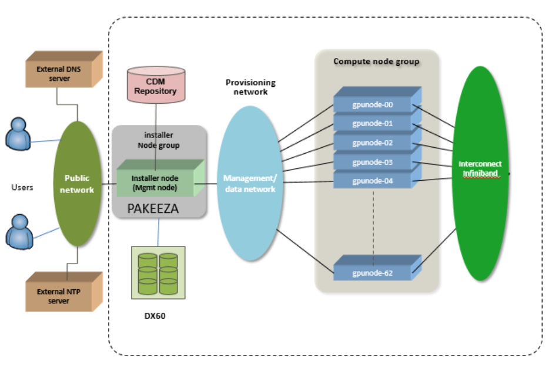

# Tutorials

Here I will place various components which I hope will be useful for people interested in Conservation Genomics. The aim is to include both raw data processing, including quality control, mapping, variant calling etc., and downstream population genetic inferences, such as population structure, phylogenetics, genetic diversity, gene flow, introgression, etc. 

## Bash

Most of the work will be done using command line. If you're not familiar with this, there are good (free!) introductory courses on [Datacamp](https://app.datacamp.com/learn/courses/introduction-to-bash-scripting]) and [CodeAcademy](https://www.codecademy.com/learn/learn-the-command-line). You can also find a good overview of the most common commands [here](https://ryanstutorials.net/linuxtutorial/navigation.php). There are tons of good resources out there, and ChatGPT can be helpful, especially when it comes to fixing the syntax.

To access Unix/Linux shell environment, you can use the native terminal when you're a Mac/Linux user. If you're on Windows, please install [MobaXterm](https://mobaxterm.mobatek.net/).

## R

For the downstream population genetics, we'll mostly be using R. Also for R, there are good (free!) introductory courses on [Datacamp](https://app.datacamp.com/learn/courses/free-introduction-to-r) and [CodeAcademy](https://www.codecademy.com/learn/learn-r). There are many good resources out there, and also here, ChatGPT can be really helpful.

## Job submission scripts

Depending on the computer infrastructure you are using, you have to run your analyses using a job submissions script. When you log in to the cluster, you're on a login node, where you can prepare your analyses, write your code, transfer data to and from etc. The actual analyses should be run on the compute nodes, which you cannot access directly. Instead, you submit your job to a scheduler through a job submission script. An example of HPC structure is below:  
<div align="center">
  
</div>

You can create a small shell script with information about the job submission and the actual code you'd like to run. You can do that in a simple text editor like Notepad (don't use Word, those programs add weird and invisible formatting which can affect your script!), or directly on the cluster by using `nano`. Start the shell script with:
```
#!/bin/bash 
#$ -pe smp 24 
#$ -o output_log.txt 
#$ -e error_log.txt
#$ -N jobname
#$ -cwd
```

#!/bin/bash: This tells the system to run the script using the Bash shell.  
#$ -pe smp 24: Requests a parallel environment (pe) named smp (shared memory parallel) with 24 CPU cores.  
#$ -o output_log.txt: Redirects standard output (stdout) (i.e., printed messages, results) to a file called output_log.txt. This can be different from output files which are generated with your actual code, like a bam or a vcf file.  
#$ -e error_log.txt: Redirects standard error (stderr) (i.e., error messages) to error_log.txt. Useful to see if the script was executed successfully.  
#$ -N jobname: Assigns a job name (instead of a difficult to remember job ID).  
#$ -cwd: Runs the job from the current working directory, instead of the default home directory or scratch.  

If you save this file as a `.sh` file, you can submit it to the scheduler like this:
```
qsub your_script.sh
```

You can track the status of your jobs by doing:
```
qstat
```

If your job is not appearing, it means that it has finished (or ended with an error :grimacing:). Otherwise, you can see in the status column what it is currently doing:
| Code | Meaning               |
|------|------------------------|
| r    | Running               |
| qw   | Queued and waiting    |
| Eqw  | Error in queue waiting|
| hqw  | Held in queue waiting |
| t    | Transferring          |
| d    | Deleting              |
| s    | Suspended             |

If you want delete a job, because it got stuck or because you realized you made a mistake in the script, use:
```
qdel <jobID>
```

**Note:** Details about the the structure of your job submission script depends on the nature of your HPC and job scheduler.

**Everything is still under construction, but feel free to reach out with feedback!**
