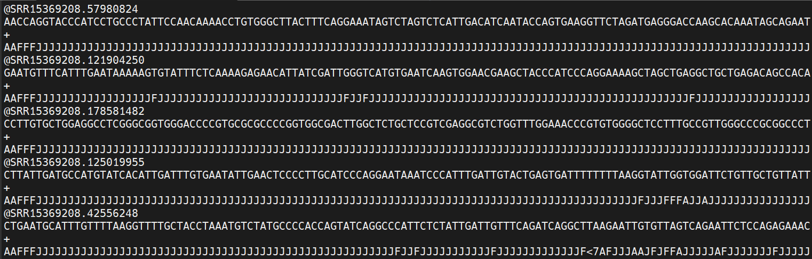
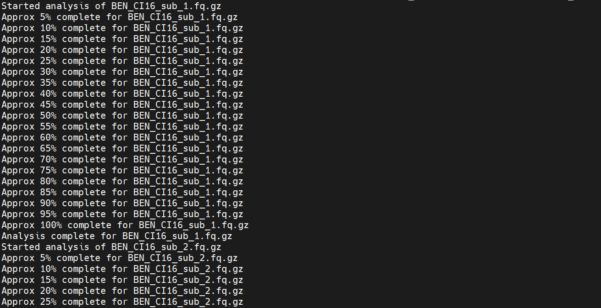
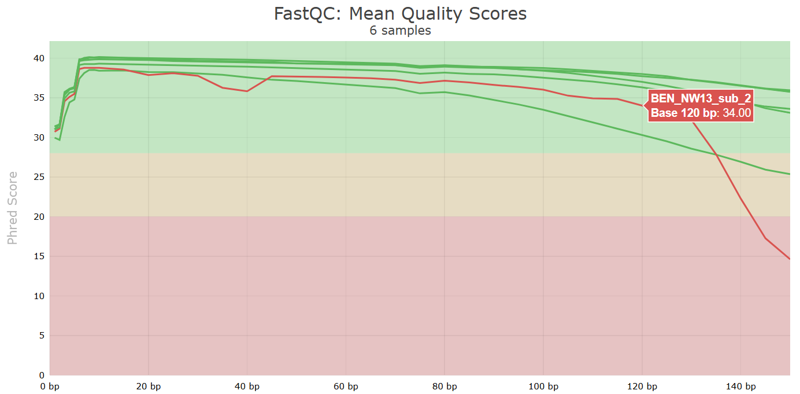
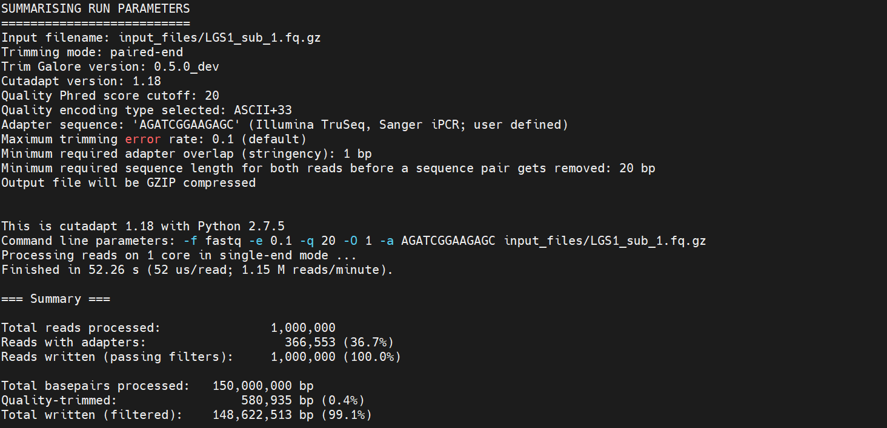
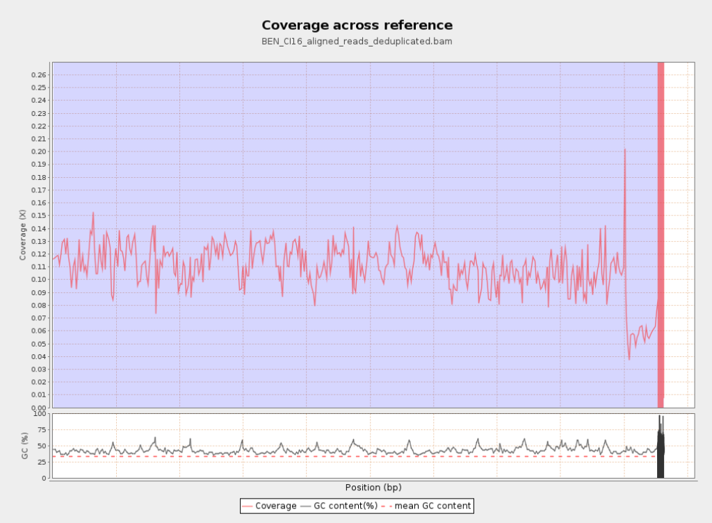

## Raw data

We'll provide raw :tiger: data for three samples to illustrate the steps of quality control, trimming and mapping. I've put the data that we'll be using here: /home/uramakri/laurabertola/Tutorial_WGS_HD/input_files
You don't have to copy the data (with large datasets, we'll run out of disk space real fast!), but it is also inconvenient if you have to navigate to my folder all the time. You can create a symbolic link (or soft link) in your own directory, which will serve as a connection to my folder.

First make a folder in your directory for this Tutorial, using `mkdir`, check if it is there with `ls`, and then go to you're newly created folder, using `cd`.
```
mkdir Tutorial_WGS_HD
```
```
ls
```
```
cd Tutorial_WGS_HD
```

Now create the symbolic link to my folder by doing the following:
```
ln -s /home/uramakri/laurabertola/Tutorial_WGS_HD/input_files input_files
```

You should now have something which *looks* like a folder, called input_files, in your directory, but actually it teleports you to *my* folder when you enter it.

The raw data come in .fastq.gz (or .fq.gz) format. Now let's take a look at the data. Go to the folder where the data are stored, using `cd`, and use `ls` to display the contents of the folder. Most of the time, you'll be working with paired-end data, meaning that each sample has two files. These are usually identified by _R1 and _R2, or _1 and _2. Those two files contain the forward and reverse reads, respectively. For more information about paired-end Illumina sequencing, watch [this video](https://www.youtube.com/watch?v=fCd6B5HRaZ8).

Now let's take a look at what's inside these files. Type the following command:
```
zcat yourfile.fq.gz | less -S
```

The `zcat` command is used to unzip the file (note it ends with .gz), and `less` allows you to view it. Here we add `-S` to chop off long lines. Otherwise it wraps around and becomes messy. Try scrolling right and down, using the arrow keys. To quit `less` type q. 
If you'd like to see the messy format, with long lines wrapping, try using `head -n 20` instead of the `less` command. `head` shows the first part of the file, and `-n 20` tells it to show the first 20 lines. 

Now to the actual data. Each sequenced read is spread over four lines, one of which contains sequence and another the quality scores stored as ASCII characters. The other two lines are used as headers to store information about the read.
It'll look something like this:


The first is the name of the read, with information about its location on the plate, or in this case the identifier from NCBI, where the data were downloaded from. The second line contains the sequence data. The third line is unused (identified with +). And the fourth line is the quality scores for the base calls. The [FASTQ wikipedia page](https://en.wikipedia.org/wiki/FASTQ_format) has a good figure depicting the logic behind how quality scores are encoded.

## FastQC for quality control

The first step is to inspect your raw data to estimate overall quality. Scrolling through the data with `less` is obviously not going to work for this. So, we'll use a software called [FastQC](https://www.bioinformatics.babraham.ac.uk/projects/fastqc/) to help us visualize overall data quality for each of our files. You can then attempt to improve your dataset by identifying and removing samples with failed sequencing. 

Let's start the run now. First go out of the input_files folder by typing `cd ..` and then make an output folder, where you will store the results in. Use `mkdir` to do this. Then run the `fastqc` command, and direct it to your newly created output folder by using -o.
```
/softwares/FastQC/fastqc input_files/* -o output_files/
```

On the screen, you'll see the progress of your FastQC run. 


>**Note:** we use *, which is a wildcard. It means *any file in the directory input_files/*. You can use wildcards also more specifically, for example `*.fq.gz`, which means all fq.gz files. Or `*R1*`, which is all files with R1 anywhere in their name, which comes in handy if you only want to process forward reads, for example.

Another key QC procedure involves inspecting average quality scores per base position and trimming read edges, which is where low quality base-calls tend to accumulate. In this figure, the X-axis shows the position on the read in base-pairs and the Y-axis depicts information about [Phred quality score](https://en.wikipedia.org/wiki/Phred_quality_score) per base for all reads, including median (center red line), IQR (yellow box), and 10%-90% (whiskers). As an example, here is a very clean base sequence quality report for a 75bp library. These reads have generally high quality across their entire length, with only a slight (barely worth mentioning) dip toward the end of the reads:


In contrast, here is a somewhat typical base sequence quality report for R1 of a 300bp paired-end Illumina run of another dataset:


This figure depicts a common artifact of current Illumina chemistry, whereby quality scores per base drop off precipitously toward the ends of reads, with the effect being magnified for read lengths >150bp. The purpose of using FastQC to examine reads is to determine whether and how much to trim our reads to reduce sequencing error interfering with basecalling. In the above figure, as in most real dataset, we can see there is a tradeoff between throwing out data to increase overall quality by trimming for shorter length, and retaining data to increase value obtained from sequencing with the result of increasing noise toward the ends of reads.

When everything is done, navigate to your output folder using `cd` and see what files were created with `ls`. 
You'll see that for each input file, FastQC created an .html and a .zip file. You want to look into the html file, which contains all the information you need for now. If you're using Mobaxterm, you can download the .html files from the panel on the left side on the screen. Or simply open it by right clicking and selecting "Open with...", and then open it in Chrome or another browser. If you're on Linux/Mac, you have to download the file. Open a new terminal window and navigate to where you want to download it to, e.g. your Downloads folder. Then use the following command:
```
scp user@cluster:~/output_files/*.html .
```

You're now telling your computer to grab the files from the server. It will therefore ask you to provide your password again. The . at the end is the location the files will be downloaded to. It means *here, the current directory*, so if you're in the Downloads folder, this is where your html files will end up in.

Open one of the html file in your browser. You'll see plots like the one above. On the left side there is a summary of the results, highlighting those sections which require your attention. Is there anything in our data we should be concerned about?


Often, you'll have a large number of samples, and you don't want to waste time looking at tons of individual html files. [MultiQC](https://docs.seqera.io/multiqc) can help you summarize the results of multiple fastqc files. Unfortunately, MultiQC needs another python version than the one which is installed system-wide. We need to first create and activate an environment which allows MultiQC to run properly. Run the following lines:

```
conda config --set ssl_verify no
```
```
conda create -n multiqc --file /home/uramakri/laurabertola/Tutorial_WGS_HD/admin/multiqc_env.txt
```
```
conda activate multiqc
```
```
conda install -c bioconda multiqc
```

Now, navigating into your output folder with the FastQC results, and do:
```
multiqc .
```


Look at the html file (download it to your computer, just like you did with the FastQC html files). It shows the results of all FastQC results in the same report. Note that the sample name appears when you hover with your cursor over a plot, so it is easy to identify which samples look strange and may require some more attention. 



Let's proceed to the next step, during which we can also tweak things if we're not confident about the raw data quality. We no longer need the environment with the other python version, so first do:
```
conda deactivate
```

## Trimming

There are multiple softwares to trim your data, e.g. [Trimmomatic](http://www.usadellab.org/cms/index.php?page=trimmomatic), [cutadapt](https://cutadapt.readthedocs.io/en/stable/) and [TrimGalore!](https://github.com/FelixKrueger/TrimGalore) (which wraps around cutadapt and FastQC). We'll use TrimGalore! here.

Run the following command:
```
for file in input_files/*_1.fq.gz; do
  mate="${file/_1.fq.gz/_2.fq.gz}"
  /softwares/TrimGalore/trim_galore --paired --illumina "$file" "$mate" --output_dir output_files
done
```

TrimGalore! does not like wildcards (*), so we have to loop over our files instead. For each file in the input_files directory which ends with _1.fq.gz, it finds the accompanying reverse reads file (mate="${file/_1.fq.gz/_2.fq.gz}"), and it runs TrimGalore over both files. You tell it that there are --paired data, it should use --ilumina adapters for trimming (check the manual for more options, in case you're using different adapters), and you also tell it to store the results in the --output_dir.

This is going to take a few minutes... :hourglass:

Trimming can be done in different ways. You can look for specific motifs (like adapter sequences), you can pick a quality cut-off to get rid of low quality bases at the ends of the reads, you can set the minimum read length to discard reads that become too short after trimming etc. So, there is a lot of flexibility depending on your needs. Note that by default TrimGalore! is discarding reads which end up as singletons, meaning if a read is being discarded its mate with automatically be discarded too. However, you can ask TrimGalore! to keep singletons by telling it --retain_unpaired. Also, if your first FastQC file showed a lot of adapter contamination, and you'd like to check how this has changed after running TrimGalore!, you can add --fastqc, so TrimGalore! will automatically run FastQC after trimming.

When the analysis finishes, look at the files it has created. You should have files with _val_1.fq.gz and _val_2.fq.gz. For each file, you also get a trimming report. Take a look what information is in there, using `less`.



If we're happy with the quality of the reads that have made it through the trimming process, we're ready to start the mapping!

## Mapping

We'll use [this reference genome](https://www.ncbi.nlm.nih.gov/datasets/genome/GCA_021130815.1/) to map our data to, but also in a downsampled version, since this is just for practice. If you've gone through the exercises successfully, you'll have the reference genome and the necessary index files in the folder where you downloaded it to. If you didn't go through the exercises, you should make softlink to my input_files folder as described at the beginning of this tutorial. The reference files with all index files can be found in input_files/reference/. 

You can also look into the reference file, the one ending with .fna, using `less`. You probably don't want to scroll through an entire genome, so you can also look at the different scaffolds. They conveniently all start with a line starting with a >, so you can use `grep` to take a look at only those lines. Make sure you're in the right folder when running this command.
```
grep ">" GCA_021130815.1_PanTigT.MC.v3_genomic.fna
```

To avoid spending too much time on this, we'll proceed with the next step with only two samples: BEN_CI16 and LGS1. Check if these are the two files which are in your output_folder/. If you have more files in your output_folder/ please move them temporarily. E.g. make a new folder with `mkdir` and move them there with `mv`. For example, I used the commands below:
```
mkdir TEMP
```
```
mv * TEMP
```
```
cd TEMP
```
```
mv BEN_CI16_sub_1_val_1.fq.gz BEN_CI16_sub_2_val_2.fq.gz LGS1_sub_1_val_1.fq.gz LGS1_sub_2_val_2.fq.gz ..
```

For the mapping, we'll use [BWA MEM](https://github.com/lh3/bwa) and a for loop to make it loop over all samples. The idea is the same as in the trimming step. We need to tell it which forward (_sub_1_val_1.fq.gz) and reverse (_sub_2_val_2.fq.gz) reads go together, tell it which reference genome to use, and where to store the output. The flag -t tells it how many cores it can use, so if you have a larger cluster and don't have a lot of people running things simultaneously, you can probably request more cores. You should be in your Tutorials folder when running this command.
```
for file1 in output_files/*_sub_1_val_1.fq.gz; do
  file2=${file1/_sub_1_val_1.fq.gz/_sub_2_val_2.fq.gz}
  sample_name=$(basename "$file1" _sub_1_val_1.fq.gz)
  bwa mem input_files/reference/GCA_021130815.1_PanTigT.MC.v3_genomic.fna -t 2 "$file1" "$file2" > "output_files/${sample_name}_aligned_reads.sam"
done
```

This step will take some time... :hourglass:

When the mapping is finished, take a look at the files that were created using `ls`. Most downstream analyses use .bam files instead of .sam files. Also, most analyses like reads to be sorted by the order they occur on the genome, not by the order in which they were processed (which is the default .sam and .bam output). To convert .sam to .bam, and order the reads, do:
```
for file in output_files/*.sam; do 
  filename=$(basename "$file" .sam)
  /softwares/samtools1.12/samtools view -S -b "$file" | /softwares/samtools1.12/samtools sort -o "output_files/${filename}_sorted.bam"
done
```

You'll see that there are two commands, separated by a pipe (|). The first part tells samtools to extract (view) the .sam (-S) reads and convert them to a .bam (-b) format. Those data are then piped into the next command, where samtools is told to sort (-sort) the reads and save the result as an output file (-o).

Bam is a binary format, which is much faster to process. But because it is binary it is not human-readable anymore. If you'd like to see what it looks like anyway, take a peak into the .sam and .bam files using 'less'. For the .sam file, you're just seeing the header (the lines starting which @). If you'd like to see the actual alingment and don't have the patience to scroll past the header, try this:
```
grep -v "^@" LGS1_aligned_reads.sam | less
```

We used `grep` before to only grab lines starting with >, here we use -v to tell it to only grab lines which do **not** start with @.

Next, we need to remove duplicates. Duplicates here refer to PCR replicates and optical replicates which falsely inflate the sequencing depth, affecting downstream variant calling. PCR duplicates are identical reads which result from the overamplification during PCR step of library preparation. Optical duplicates arise from sequencing machine artifacts, when a cluster is wrongly interpreted as multiple nearby clusters. We use [Picard](https://gatk.broadinstitute.org/hc/en-us/articles/360037052812-MarkDuplicates-Picard) for this step. Run the following:
```
for file in output_files/*_sorted.bam; do
  base=$(basename "$file" _sorted.bam)
  java -jar /softwares/picard/build/libs/picard.jar MarkDuplicates \
  I="$file" \
  O="output_files/${base}_deduplicated.bam" \
  M="output_files/${base}_duplication_metrics.txt" \
  REMOVE_DUPLICATES=TRUE
done
```

We use a for loop again, and the command needs an input file (I), some information about the output file it should generate (O), as well as a metrics file (M). --REMOVE_DUPLICATES tells it to remove the duplicate reads, instead of just marking them. Check if the expected output files are generated, using `ls`.

We also have to index the .bam file again. This time we use [samtools](https://www.htslib.org/).
```
for bam in output_files/*_deduplicated.bam; do
  /softwares/samtools1.12/samtools index "$bam"; 
done
```

Do `ls` to see what changed. You should now also have .bam.bai files.

We now have .bam files which are ready to go for downstream processing. But we haven't really looked at the mapping quality yet. We can do so with the tool [Qualimap](https://qualimap.conesalab.org/). Run the following:
```
for bam in output_files/*_deduplicated.bam; do
    sample=$(basename "$bam" .bam)
    /softwares/qualimap_v2.2.1/qualimap bamqc \
        -bam "$bam" \
        -outdir output_files/qualimap_results/${sample}_qualimap \
        -outformat HTML
done
```

It will create an bunch of files, and store them in a qualimap_results folder (note that you asked it to create this folder to put all the output files in). Download the entire folder (just like you did with the FastQC results) and look at the html file it in your browser. Because Qualimap does not embed the images in their html files (unlike FastQC), you need to download the entire folder. Take a look at the images at the bottom of the report (you can click the links on the right side of the page), especially the coverage across the reference and coverage histogram. It should look something like this:


>**Note:** for the sake of this tutorial, we've used downsampled data, so this is expected to be very, very low. However, the next step of the pipeline assumes that you have medium-high (>6X) depth, so we can call heterozygote positions reliably. Go to the [next part](Variant_Calling_Filtering.md), in which we will create a vcf file with variants and filter the results for downstream analyses.

>**Housekeeping**: we have created quite a few large files, and it is good practice to delete what you don't need anymore. You could for example delete the .sam files, and the _sorted.bam files which were later deduplicated. You can remove files with `rm`, but be careful! It will not ask you if you're certain and it cannot be undone. Always keep the raw data, and keep the final .bam files as they will be needed for the variant calling.
