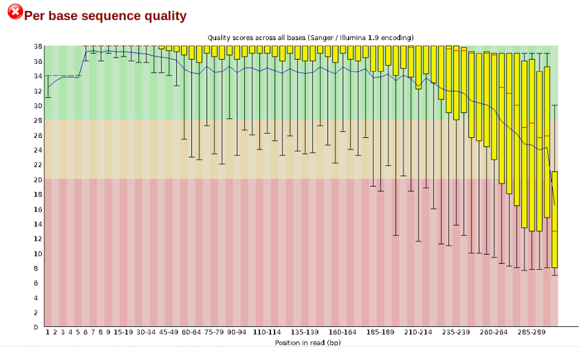

## Raw data

We'll provide raw :tiger: data for three samples to illustrate the steps of quality control, trimming and mapping. The raw data come in .fastq.gz (or .fq.gz) format. Let's take a look at the data first.

Go to the folder where the data are stored, using `cd`, and use `ls` to display the contents of the folder. Most of the time, you'll be working with paired-end data, meaning that each sample has two files. These are usually identified by _R1 and _R2, or _1 and _2. Those two files contain the forward and reverse reads, respectively. For more information about paired-end Illumina sequencing, watch [this video](https://www.youtube.com/watch?v=fCd6B5HRaZ8).

Now let's take a look at what's inside these files. Type the following command:
```
user@cluster:~$ zcat yourfile.fq.gz | less -S
```

The `zcat` command is used to unzip the file (note it ends with .gz), and `less` allows you to view it. Here we add `-S` to chop off long lines. Otherwise it wraps around and becomes messy. Try scrolling right and down, using the arrow keys. To quit `less` type q. 
If you'd like to see the messy format, with long lines wrapping, try using `head -n 20` instead of the `less` command. `head` shows the first part of the file, and `-n 20` tells it to show the first 20 lines. 

Now to the actual data. Each sequenced read is spread over four lines, one of which contains sequence and another the quality scores stored as ASCII characters. The other two lines are used as headers to store information about the read.
It'll look something like this:


The first is the name of the read, with information about its location on the plate, or in this case the identified from NCBI, where the data were downloaded from. The second line contains the sequence data. The third line is unused (identified with +). And the fourth line is the quality scores for the base calls. The [FASTQ wikipedia page](https://en.wikipedia.org/wiki/FASTQ_format) has a good figure depicting the logic behind how quality scores are encoded.

## FastQC for quality control
The first step is to inspect your raw data to estimate overall quality. Scrolling through the data with `less` is obviously not going to work for this. So, we'll use a software called [FastQC](https://www.bioinformatics.babraham.ac.uk/projects/fastqc/) to help us visualize overall data quality for each of our files. At this stage you can then attempt to improve your dataset by identifying and removing samples with failed sequencing. Another key QC procedure involves inspecting average quality scores per base position and trimming read edges, which is where low quality base-calls tend to accumulate. In this figure, the X-axis shows the position on the read in base-pairs and the Y-axis depicts information about [Phred quality score](https://en.wikipedia.org/wiki/Phred_quality_score) per base for all reads, including median (center red line), IQR (yellow box), and 10%-90% (whiskers). As an example, here is a very clean base sequence quality report for a 75bp library. These reads have generally high quality across their entire length, with only a slight (barely worth mentioning) dip toward the end of the reads:


In contrast, here is a somewhat typical base sequence quality report for R1 of a 300bp paired-end Illumina run of another RADseq dataset:



This figure depicts a common artifact of current Illumina chemistry, whereby quality scores per base drop off precipitously toward the ends of reads, with the effect being magnified for read lengths >150bp. The purpose of using FastQC to examine reads is to determine whether and how much to trim our reads to reduce sequencing error interfering with basecalling. In the above figure, as in most real dataset, we can see there is a tradeoff between throwing out data to increase overall quality by trimming for shorter length, and retaining data to increase value obtained from sequencing with the result of increasing noise toward the ends of reads.

Now, let's run FastQC on our data. First make an output folder, where you will store the results in. Use `mkdir` to do this. Then run the `fastqc` command, and direct it to your newly created output folder by using -o.
```
user@cluster:~$/softwares/FastQC/fastqc ~/Tutorial/input_files/* -o ~/Tutorial/output_files/
```

On the screen, you'll see the progress of your FastQC run. 


When everything is done, navigate to your output folder using `cd` and see what files were created with `ls`. 
You'll see that for each input file, FastQC created an .html and a .zip file. You want to look into the html file, which contains all the information you need for now. If you're using Mobaxterm, you can download the .html files from the panel on the left side on the screen. If you're on Linux/Mac, you can download the files using:
```
scp user@cluster:~/path_to_your_folder/output_files/*.html ~/
```

Open one of the html file in your browser. You'll see plots like the one above. On the left side there is a summary of the results, highlighting those sections which require your attention. Is there anything in our data we should be concerned about?


Often, you'll have a large number of samples, and you don't want to waste time looking at tons of individual html files. [MultiQC](https://docs.seqera.io/multiqc) can help you summarize the results of multiple fastqc files. You can do this by navigating into your output folder with the FastQC results, and do:
```
multiqc .
```


Look at the html file (download it to your computer, just like you did with the FastQC html files). It shows the results of all FastQC results in the same report. Note the the sample name appears when you hover with your cursor over a plot, so it is easy to identify which samples look strange and may require some more attention. 


Let's proceed to the next step, during which we can also tweak things if we're not confident about the raw data quality.

## Trimming

There are multiple softwares to trim your data, e.g. [Trimmomatic](http://www.usadellab.org/cms/index.php?page=trimmomatic), [cutadapt](https://cutadapt.readthedocs.io/en/stable/) and [TrimGalore!](https://github.com/FelixKrueger/TrimGalore) (which wraps around cutadapt and FastQC). We'll use Trimmomatic here.

Run the following command:
```
for file in input_files/*_1.fq.gz
do
  mate="${file/_1.fq.gz/_2.fq.gz}"
  /softwares/TrimGalore/trim_galore --paired --illumina "$file" "$mate" --output_dir output_files &
done
```

TrimGalore! does not like wildcards (*), so we have to loop over our files instead. For each file in the input_files directory which ends with _1.fq.gz, it finds the accompanying reverse reads file (mate="${file/_1.fq.gz/_2.fq.gz}"), and it runs TrimGalore over both files. You tell it that there are --paired data, it should use --ilumina adapters for trimming (check the manual for more options, in case you're using different adapters), and you also tell it to store the results in the --output_dir. Finally, you can add & to make it run in parallel.

This is going to take a few minutes... :stopwatch:

Trimming can be done in different ways. You can look for specific motifs (like adapter sequences), you can pick a quality cut-off to get rid of low quality bases at the ends of the reads, you can set the minimum read length to discard reads that become too short after trimming etc. So, there is a lot of flexibility depending on your needs. Note that by default TrimGalore! is discarding reads which end up as singletons, meaning if a read is being discarded its mate with automatically be discarded too. However, you can ask TrimGalore! to keep singletons by telling it --retain_unpaired. Also, if your first FastQC file showed a lot of adapter contamination, and you'd like to check how this has changed after running TrimGalore!, you can add --fastqc, so TrimGalore! will automatically run FastQC after trimming.

When the analysis finishes, look at the files it has created. You should have files with _val_1.fq.gz and _val_2.fq.gz. For each file, you also get a trimming report. Take a look what information is in there, using `less`.


If we're happy with the quality of the reads that have made it through the trimming process, we're ready to start the mapping!

## Mapping


