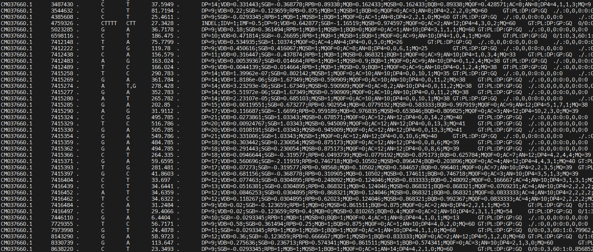
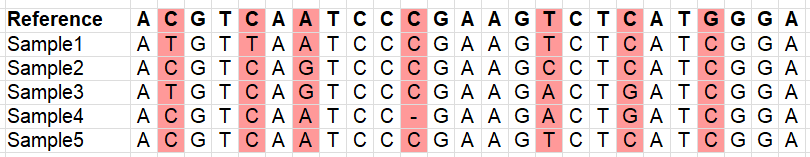
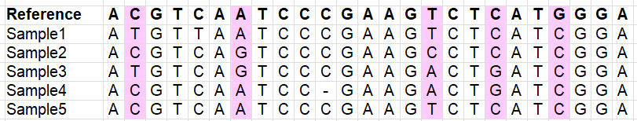
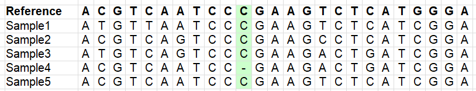

## Variant calling
Now we have all the genomes mapped, with reads sorted and deduplicated, and all .bam files indexed. We can now proceed to call the variant positions that we'll be using for downstream analyses. There are different variant callers out there, but here we'll use [bcftools](https://samtools.github.io/bcftools/bcftools.html). Run the following:
```
/softwares/bcftools1.12/bcftools mpileup -Ou -f input_files/reference/GCA_021130815.1_PanTigT.MC.v3_genomic.fna output_files/*deduplicated.bam | \
/softwares/bcftools1.12/bcftools call -f GQ,GP -mv -Ov -o unfiltered_variants.vcf
```

The command has quite a few layers, so let's unpack those here. The `mpileup` command basically collects and summarized the data from all the .bam files, using the reference (indicated by the -f flag). The flag -Ou specifies that the output file should be uncompressed. This file then gets piped (|) into the next command, which is `call`. You ask it to use a multiallelic caller and output variant sites only (-mv). You can also ask for more information fields by using the -f flag with the `call` command (note that in this context, the -f flag means something else than the -f flag with the `mpileup` command!). Further, you specify that the output file should be an uncompressed vcf file (-Ov) and you specify the where the output file should be saved (-o).

You can also output a bcf file. The difference between vcf and bcf is similar to sam and bam, as we saw previously. vcf is human-readable, but slowerw to process. bcf is binary and not human-readable, but therefore smaller in file size and faster to process in pipelines. Either way, this step will take some time... :hourglass:

A vcf file contains a lot of information, and there are many ways of adjusting what the output should look like. More information about the format of vcf files, as well as additional flags to use, can be found [here](https://samtools.github.io/hts-specs/VCFv4.2.pdf). Our vcf file will contain the following information fields:
| FORMAT Tag | Description                                                                 |
|------------|-----------------------------------------------------------------------------|
| `GT`       | Genotype — encoded like `0/0`, `0/1`, `1/1`, etc.                           |
| `GQ`       | Genotype Quality — Phred-scaled confidence in the genotype call            |
| `DP`       | Read Depth — total number of reads covering the site for the sample        |
| `PL`       | Phred-scaled genotype Likelihoods — likelihoods for `0/0`, `0/1`, and `1/1` |

In the fields above, 0 stands for the reference allele, whereas 1 stands for the derived allele. Let's take a closer look at our vcf file. First, we'll start with the header, by using -h:
```
/softwares/bcftools1.12/bcftools view -h unfiltered_variants.vcf
```

Lots of info here, but the last line is quite important, because it tells you what the format is of the vcf file:  
#CHROM  POS     ID      REF     ALT     QUAL    FILTER  INFO    FORMAT 

Now, let's take a look at the actual data, instead of the header, and use `less` -S so it doesn't print all the variants on the screen:
```
/softwares/bcftools1.12/bcftools view -H unfiltered_variants.vcf | less -S
```

You should see something like this:


You can scroll through it, see what the reference allele and the alternative alleles are for each of the positions, and what information is available per sample. There is a lot of information in the INFO column:  
| INFO Tag   | Description                                                                                   |
|------------|--------------------------------------------------------------------------------------------|
| `DP`       | Total read depth at this position (from all samples)                                      |
| `SGB`      | Segregation-based score used internally by `bcftools` to penalize low-quality calls       |
| `MQ0F`     | Fraction of reads with mapping quality zero — `0` means all reads were well-mapped        |
| `AC`       | Allele count for the ALT allele                                                           |
| `AN`       | Allele number — total number of called alleles (e.g., diploid × number of samples)        |
| `DP4`      | Strand-specific read depth: REF-forward, REF-reverse, ALT-forward, ALT-reverse            |
| `MQ`       | Average mapping quality of reads covering this site                                       |

We are not going to look at the content of the file in much more detail now, because there's still a lot of junk in there. First, we'll do some filtering. But before we move on, you may be curious how many variants are in your vcf file. We can do this by counting all the lines (`wc -l`) of all the data lines (i.e. not including the header):
```
/softwares/bcftools1.12/bcftools view -H unfiltered_variants.vcf | wc -l
```

## Variant filtering
Our vcf file has a lot of variants, but we don't want to use everything. For example, there will be a lot of noise in the file, e.g. positions which do not have reliable information, or have missing data for most samples (remember this is a downsampled dataset!). We therefore need to filter our vcf file. The images below illustrate different types of variants which you may or may not want to retain (depending on your research question!).

Variants:  


Variants which occur in more than one sample (to avoid sequencing errors to be included as a variant):  


Variants which are indels (lots of downstream analyses don't like these, error-prone:  


Variants which are multi-allelic (lots of downstream analyses don't like these, error-prone):  


Variants which are variable within your samples (imaginge what happens if you use a reference genome of another species):  


We will now use some very common filters, and to get an idea of the impact of filtering, we'll count the number of retained variants after each step.

1. Bi-allelic SNPs only (i.e. no indels; m2 = min. 2 alleles, M2 = max. 2 alleles):
```
/softwares/bcftools1.12/bcftools view -v snps -m2 -M2 unfiltered_variants.vcf -o variants_snps.vcf
/softwares/bcftools1.12/bcftools view -H variants_snps.vcf | wc -l
```
2. Remove low quality base calls
```
/softwares/bcftools1.12/bcftools filter -e 'QUAL >= 30' variants_snps.vcf -o variants_snps_qual30.vcf
/softwares/bcftools1.12/bcftools view -H variants_snps_qual30.vcf | wc -l
```
3. Filter for minor allele frequency (MAF) (removing rare SNPs, which may be caused by sequencing errors):
```
/softwares/bcftools1.12/bcftools filter -e 'AF<0.05 || AF>0.95' variants_snps_qual30.vcf -o variants_snps_qual30_maf05.vcf
/softwares/bcftools1.12/bcftools view -H variants_snps_qual30_maf05.vcf | wc -l
```
4. Filter for low quality genotypes (per sample)
```
/softwares/bcftools1.12/bcftools filter -e 'FMT/GQ >= 30' variants_snps_qual30_maf05.vcf -o variants_snps_qual30_maf05_gq30.vcf
/softwares/bcftools1.12/bcftools view -H variants_snps_qual30_maf05_gq30.vcf | wc -l
```

Now, we have our final dataset, and we can look at a few more things in detail. E.g. we can look at a specific chromosome or region:
```
/softwares/bcftools1.12/bcftools view -H -r chr2:100000-200000 variants_snps_qual30_maf05_gq30.vcf
```

We may also want to look in more detail at the positions that ended up in our file, for example by looking at the genotypes:
```
/softwares/bcftools1.12/bcftools query -f '%CHROM\t%POS\t%REF\t%ALT[\t%GT]\n' variants_snps_qual30_maf05_gq30.vcf | head
```

Or, because it's easier to interpret, basecalls:
```
/softwares/bcftools1.12/bcftools query -f '%CHROM\t%POS\t%REF\t%ALT[\t%TGT]\n' variants_snps_qual30_maf05_gq30.vcf | head
```

We will do one final step of filtering, by excluding positions which have too high 'missingness'. What an appropriate threshold for missingness is depends highly on your data and your research question. It is also good to look at the distribution of missing data across samples. Let's do that here.

```
/softwares/bcftools1.12/bcftools query -f '[%GT\t]\n' variants_snps_qual30_maf05_gq30.vcf | \
awk '{
  for (i=1; i<=NF; i++) if ($i == "./.") missing[i]++;
}
END {
  for (i in missing) print "Sample" i, missing[i];
}' | sort -k2 -nr
```

We also want to explore different levels of missingsness across samples, so we can remove SNPs for which we have only data for a single sample, for example. We're going to filter for a couple of different levels, for positions that have <0.1, <0.25, <0.5 and <0.75 missing data. To achieve this, we need to add a missingness tag first, and can pipe the result in to the filter. We will also count the number of retained SNPs again.
```
/softwares/bcftools1.12/bcftools +fill-tags -Ov variants_snps_qual30_maf05_gq30.vcf -- -t F_MISSING  | \
/softwares/bcftools1.12/bcftools view -i 'INFO/F_MISSING<0.1' -Ov -o variants_snps_qual30_maf05_gq30_missing01.vcf
/softwares/bcftools1.12/bcftools view -H variants_snps_qual30_maf05_gq30_missing01.vcf | wc -l
```
```
/softwares/bcftools1.12/bcftools +fill-tags -Ov variants_snps_qual30_maf05_gq30.vcf -- -t F_MISSING  | \
/softwares/bcftools1.12/bcftools view -i 'INFO/F_MISSING<0.25' -Ov -o variants_snps_qual30_maf05_gq30_missing025.vcf
/softwares/bcftools1.12/bcftools view -H variants_snps_qual30_maf05_gq30_missing025.vcf | wc -l
```
```
/softwares/bcftools1.12/bcftools +fill-tags -Ov variants_snps_qual30_maf05_gq30.vcf -- -t F_MISSING  | \
/softwares/bcftools1.12/bcftools view -i 'INFO/F_MISSING<0.5' -Ov -o variants_snps_qual30_maf05_gq30_missing05.vcf
/softwares/bcftools1.12/bcftools view -H variants_snps_qual30_maf05_gq30_missing05.vcf | wc -l
```
```
/softwares/bcftools1.12/bcftools +fill-tags -Ov variants_snps_qual30_maf05_gq30.vcf -- -t F_MISSING  | \
/softwares/bcftools1.12/bcftools view -i 'INFO/F_MISSING<0.75' -Ov -o variants_snps_qual30_maf05_gq30_missing075.vcf
/softwares/bcftools1.12/bcftools view -H variants_snps_qual30_maf05_gq30_missing075.vcf | wc -l
```
