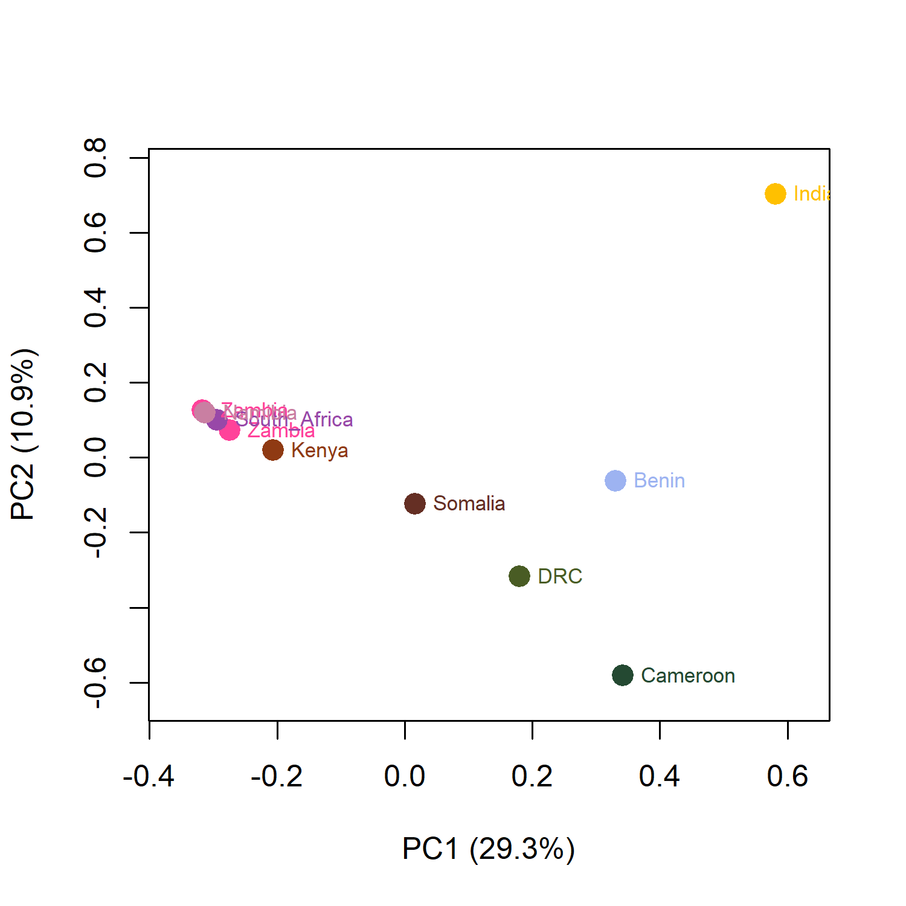

## Genotype likelihood inference

Now we have all the genomes mapped, with reads sorted and deduplicated, and all .bam files indexed. We can now proceed to infer the genotype likelihoods. As we said, because these are low depth samples (~3X), we cannot call hard genotypes with certainty. Imagine you have a position with 2X or 3X coverage, how certain would you be this truly is homozogous if you only find 1 allele? So instead we'll use genotype likelihoods as implemented in [ANGSD](https://www.popgen.dk/angsd/index.php/ANGSD). 

We want to give ANGSD a list with all the bam files we'd like to include for ANGSD. Note that this also easily allows you to exclude a sample in case it has much lower quality than the rest. Run the following:
```
find . -name "*deduplicated*.bam" > all_bams.list
```

You should now have a txt file which is called all_bams.list in your directory. If you'd like to check the contents, use `cat`.

Now we can proceed to actually running ANGSD:
```
/softwares/angsd/angsd
  -bam all_bams.list \
  -ref /Reference/Panthera_leo_krugeri_HiC.fasta
  -uniqueOnly 1 -remove_bads 1 -only_proper_pairs 1 -C 50 -baq 2 \
  -minMapQ 30 -minQ 20 \
  -GL 1 \               	
  -doMajorMinor 1 \       	
  -doMaf 1 \             
  -SNP_pval 1e-4 \        
  -minInd 5 \             
  -nThreads 16 \
  -doGlf 2 \               
  -out all_minind5
```

In this command, we also apply some filters. If you'd like brush up on some considerations regarding filtering, read the section on [filtering for high depth genomes](https://github.com/LauraBertola/Tutorials/blob/main/WGS%20(high%20depth)/Variant_Calling_Filtering.md). Obviously, we use a different approach for low depth genomes here, but a lot of the considerations are similar.  

Let's go through the various parts of the ANGSD command one by one.

**Input**  
First you tell it what BAM files to use, by referring to the list you made with `bam`. You also tell it which reference to use with `ref`.

**Basic read filters**
- `-uniqueOnly 1` — keep only uniquely mapping reads (no multimapping). Good for avoiding false SNPs, especially in genomes with repeats.  
- `-remove_bads 1` — remove unmapped reads, secondary/supplementary alignments, QC-failed reads.  
- `-only_proper_pairs 1` — keep only reads for which both forward and reverse are correctly mapped.  
- `-C 50` — adjusts reads for excessive mismatches near indels, prevents false SNP calls due to alignment artifacts.  
- `-baq 2` — BAQ (Base Alignment Quality) recalibration, reduces false positives near indels.

**Quality filters**
- `-minMapQ 30` — minimum mapping quality, which makes sure that the mapped reads are confidently placed.  
- `-minQ 20` — minimum base quality, ensures only reliable bases contribute to likelihoods.

**Genotype likelihood model**
Further parameters include `-GL 1`, which refers to the SAMtools genotype likelihood model, suitable for low/medium coverage samples with not overly damaged DNA.

**Allele discovery**
- `-doMajorMinor 1` — automatically infer major and minor alleles from data.  
- `-doMaf 1` — calculate minor allele frequency.  
- `-SNP_pval 1e-4` — site is considered polymorphic if likelihood of being invariant < 10⁻⁴. A lower value corresponds to more conservative SNP calling.

**Missing data threshold**
Then comes an important parameter, `-minInd 5` which determines how much missing values you'll have in your output file.  
Here, we allow for **50% missingness**, by asking to only include sites for which **at least 5 (out of 10) individuals** have data. This is something you might want to adjust to explore how missing data will affect downstream analyses, like PCA.

**Other important parameters**
- `-nThreads` — the number of threads used for the analysis.  
- `-doGlf 2` — write genotype likelihoods in gzipped Beagle format.  
- `-out` — determines the prefix for the output files.

There are tons of other options in ANGSD which may come in handy. For example, you can tell ANGSD to use only information from certain scaffolds in the reference genome. You may not want to include all the unplaced scaffolds and only include autosomes (i.e. excluding sex chromosomes). You can make a list with scaffold names (as they are named in the reference genome) and feed this to ANGSD using `-rf`. And more information can be found on the [ANGSD wiki](https://www.popgen.dk/angsd/index.php/ANGSD).

Following the command we used, ANGSD will save three output files:
- arg — a record of all the parameters used in the command, as well as a record of how long the analysis took.  
- beagle.gz — BEAGLE-format genotype likelihoods (used by PCAngsd, ngsAdmix).
- mafs.gz — MAF values for each site, with major/minor allele.

If you'd like to know how many SNPs were retained, simply call the lines of the beagle or mafs file:
```
zcat all_minind5.beagle.gz | wc -l
```

## Population structure with PCAngsd

Apart from knowing how many SNPs we have, we'd actually also like to know what the data look like, for example when plotting a PCA. There is a special tool, [PCAngsd](https://www.popgen.dk/software/index.php/PCAngsd), which allows you to estimate the covariance matrix and individual allele frequencies for low-depth data, directly from the beagle file you created in the previous step.

First we need to activate the correct environment:
```
conda activate pcangsd
```

Then, run this:
```
pcangsd -b all_minind5.beagle.gz -o all_minind5 -t 8 --iter 1000
```

You tell it the input file (-b), the output files prefix (-o), how many threads to use for computation (-t) and a number of iterations to run (--iter). When the run is finished, and hopefully converged (it will tell you on the screen), you should have the following files: .cov and .log. Some versions of PCAngsd also produce .eigenvec and .eigenval files, but we can easily compute them ourselves from the covariance matrix (.cov), so we don't really need them.

Now, download the .cov file to your computer, as well as the all_bams.list files, so we can look at the results in R.

In R studio, run the following:
```
# Read in eigenvectors
cov <- as.matrix(read.table("all_minind5.cov"))
eig <- eigen(cov)
eigval <- eig$values
eigvec <- eig$vectors
write.table(eig$values, "all_minind5.eigenval.txt",
            quote = FALSE, row.names = FALSE, col.names = FALSE)
write.table(eig$vectors, "all_minind5.eigenvec.txt",
            quote = FALSE, row.names = FALSE, col.names = paste0("PC", 1:ncol(eig$vectors)))
variance_explained <- eig$values / sum(eig$values)
print(variance_explained[1:6])  # first 6 PCs

# Load sample names (from your bam list)
samples <- basename(readLines("all_bams.list"))

### Species PCA
# Assign species manually
species <- c(
  rep("Somalia", 1),
  rep("India", 1),
  rep("Zambia", 1),
  rep("Kenya", 1),
  rep("Zambia", 1),
  rep("DRC", 1),
  rep("Benin", 1),
  rep("South_Africa", 1),
  rep("Namibia", 1),
  rep("Cameroon", 1),
)

# Colors for species
species_colors <- c("Benin"="#9DB3F1",
                    "Cameroon"="#244932",   
                    "DRC"="#495C24", 
                    "Somalia"="#652F24", 
                    "Kenya"="#8f3a13", 
                    "Zambia"="#FF429A", 
                    "South_Africa"="#9848A8", 
                    "Namibia"="#C97FA2",
                    "India"="#FFC000"
                    )

# Make a data.frame
pca_df <- data.frame(
  Sample = samples,
  Species = species,
  PC1 = eigvec[,1],
  PC2 = eigvec[,2]
)

png("PCA.png", width = 1500, height = 1500, res = 300)

# Plot
plot(pca_df$PC1, pca_df$PC2, 
     col = species_colors[pca_df$Species],
     pch = 19, 
     cex = 1.5,
     xlab = paste0("PC1 (", round(eigval[1]/sum(eigval)*100, 1), "%)"),
     ylab = paste0("PC2 (", round(eigval[2]/sum(eigval)*100, 1), "%)"))

text(pca_df$PC1, pca_df$PC2, 
     labels = pca_df$Species, 
     pos = 4,  # position: above points
     cex = 0.7, 
     col = species_colors[as.character(pca_df$Species)])

dev.off()
```

This code will save two tables, one with eigenvectors and one with eigenvalues, calculated from the covariance matrix we got from PCAngsd. It also plots a PCA, with the population labels and colors defined in the code. It should look something like this:

