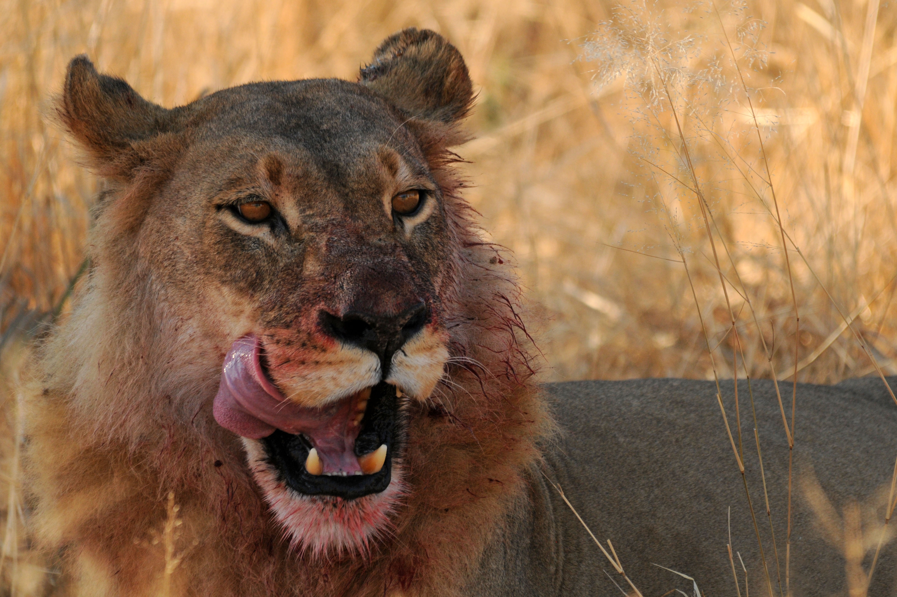

# WGS (low depth)
This part will deal with processing of whole genome sequencing data (WGS) of low sequencing depth. Here, I'm referring to 1-5X genome-wide average sequencing depth, which does not allow for calling heterozygous sites reliably using hard calls. Instead, we'll used the ANGSD framework to obtain genotype likelihoods, which leverages information from all samples by looking at overall allele frequencies.

This section will use data from lions from [Bertola et al. (2022)](https://bmcgenomics.biomedcentral.com/articles/10.1186/s12864-022-08510-y). 

You can find the steps for downloading, quality control, trimming and mapping [here](FastQC_Trimming_Mapping.md).  
Genotype-likelihood computation and probabilistic SNP filtering [here](Genotype_Likelihoods_Filtering.md).  

:camera: Lion in Okavango Delta, Botswana

©Laura Bertola
