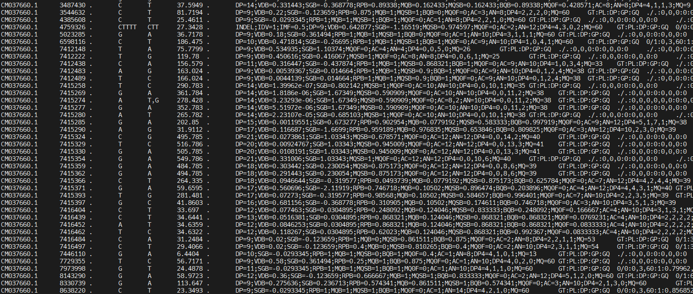
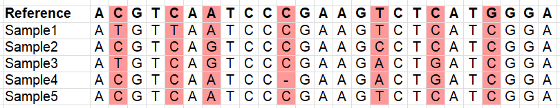
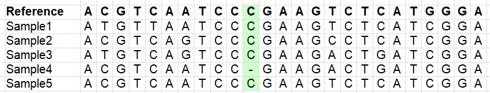
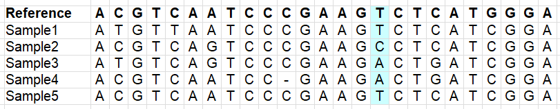

## Variant calling

Now we have all the genomes mapped, with reads sorted and deduplicated, and all .bam files indexed. We can now proceed to call the variant positions that we'll be using for downstream analyses. There are different variant callers out there, but here we'll use [bcftools](https://samtools.github.io/bcftools/bcftools.html). Run the following:
```
/softwares/bcftools1.12/bcftools mpileup -Ou -f input_files/reference/GCA_021130815.1_PanTigT.MC.v3_genomic.fna -a FORMAT/DP output_files/*deduplicated.bam | \
/softwares/bcftools1.12/bcftools call -f GQ,GP -mv -Ov -o unfiltered_variants.vcf

```

The command has quite a few layers, so let's unpack those here. The `mpileup` command basically collects and summarized the data from all the .bam files, using the reference (indicated by the -f flag). We also tell it that we want it to save per sample depth for each site, so we add -a FORMAT/DP. The flag -Ou specifies that the output file should be uncompressed. This file then gets piped (\|) into the next command, which is `call`. You ask it to use a multiallelic caller and output variant sites only (-mv). You can also ask for more information fields by using the -f flag with the `call` command (note that in this context, the -f flag means something else than the -f flag with the `mpileup` command!). Further, you specify that the output file should be an uncompressed vcf file (-Ov) and you specify the where the output file should be saved (-o).

You can also output a bcf file. The difference between vcf and bcf is similar to sam and bam, as we saw previously. vcf is human-readable, but slower to process. bcf is binary and not human-readable, but therefore smaller in file size and faster to process in pipelines. Either way, this step will take quite a lot of time... ⌛

A vcf file contains a lot of information, and there are many ways of adjusting what the output should look like. More information about the format of vcf files, as well as additional flags to use, can be found [here](https://samtools.github.io/hts-specs/VCFv4.2.pdf). Our vcf file will contain the following information fields:
| FORMAT Tag | Description |
|------------|-------------|
| `GT`       | Genotype — encoded like `0/0`, `0/1`, `1/1`, etc. |
| `PL`       | Phred-scaled genotype likelihoods — likelihoods for `0/0`, `0/1`, and `1/1` |
| `DP`       | Read depth — total number of reads covering the site for the sample |
| `GP`       | Genotype probabilities — normalized probabilities for each genotype, summing to 1.0 |
| `GQ`       | Genotype quality — Phred-scaled confidence in the genotype call |

In the fields above, 0 stands for the reference allele, whereas 1 stands for the derived allele. Let's take a closer look at our vcf file. First, we'll start with the header, by using -h:
```
/softwares/bcftools1.12/bcftools view -h unfiltered_variants.vcf
```

Lots of info here, but the last line is quite important, because it tells you what the format is of the vcf file:  
#CHROM  POS     ID      REF     ALT     QUAL    FILTER  INFO    FORMAT 

Now, let's take a look at the actual data, instead of the header, and use `less -S` so it doesn't print all the variants on the screen:
```
/softwares/bcftools1.12/bcftools view -H unfiltered_variants.vcf | less -S
```

You should see something like this:


You can scroll through it, see what the reference allele and the alternative alleles are for each of the positions, and what information is available per sample. There is a lot of information in the INFO column:  
| INFO Tag | Description |
|----------|-------------|
| `DP`     | Total read depth at this position (from all samples) |
| `SGB`    | Segregation-based score used internally by `bcftools` to penalize low-quality calls |
| `MQ0F`   | Fraction of reads with mapping quality zero — `0` means all reads were well-mapped |
| `AC`     | Allele count for the ALT allele |
| `AN`     | Allele number — total number of called alleles (e.g., diploid × number of samples) |
| `DP4`    | Strand-specific read depth: REF-forward, REF-reverse, ALT-forward, ALT-reverse |
| `MQ`     | Average mapping quality of reads covering this site |

We are not going to look at the content of the file in much more detail now, because there's still a lot of junk in there. First, we'll do some filtering. But before we move on, you may be curious how many variants are in your vcf file. We can do this by counting all the lines (`wc -l`) of all the data lines (i.e. not including the header):
```
/softwares/bcftools1.12/bcftools view -H unfiltered_variants.vcf | wc -l
```

## Variant filtering

Our vcf file has a lot of variants, but we don't want to use everything. There is a lot of noise in the file, e.g. positions which do not have reliable information, or have missing data for most samples (remember this is a downsampled dataset!). We therefore need to filter our vcf file. The images below illustrate different types of variants which you may or may not want to retain (depending on your research question!).

Variants:  


Variants which occur in more than one sample (to avoid sequencing errors to be included as a variant):  


Variants which are indels (lots of downstream analyses don't like these, error-prone):  


Variants which are multi-allelic (lots of downstream analyses don't like these, error-prone):  


Variants which are variable within your samples (imagine what happens if you use a reference genome of another species):  


We will now use some very common filters, and we'll count the number of line to monitor how many SNPs were retained. 

**1. Bi-allelic SNPs only (i.e. no indels; m2 = min. 2 alleles, M2 = max. 2 alleles)**
```
/softwares/bcftools1.12/bcftools view -v snps -m2 -M2 unfiltered_variants.vcf -o variants_snps.vcf
/softwares/bcftools1.12/bcftools view -H variants_snps.vcf | wc -l
```
**2. Remove low quality base calls**
```
/softwares/bcftools1.12/bcftools filter -e 'QUAL < 30' variants_snps.vcf -o variants_snps_qual30.vcf
/softwares/bcftools1.12/bcftools view -H variants_snps_qual30.vcf | wc -l
```
**3. Filter for minor allele frequency (MAF) (removing rare SNPs, which may be caused by sequencing errors)**
```
/softwares/bcftools1.12/bcftools filter -e 'INFO/AF < 0.05 || INFO/AF > 0.95' variants_snps_qual30.vcf -o variants_snps_qual30_maf05.vcf
/softwares/bcftools1.12/bcftools view -H variants_snps_qual30_maf05.vcf | wc -l
```
**4. Filter for low quality genotypes (per sample)**
```
/softwares/bcftools1.12/bcftools filter -e 'FMT/GQ >= 30' variants_snps_qual30_maf05.vcf -o variants_snps_qual30_maf05_gq30.vcf
/softwares/bcftools1.12/bcftools view -H variants_snps_qual30_maf05_gq30.vcf | wc -l
```
**5. Filter out sites with very low depth (impossible to reliably call a genotype) and very high depth (likely mapping errors)**
```
/softwares/bcftools1.12/bcftools filter -e 'INFO/DP <= 18 || INFO/DP >= 60' variants_snps_qual30_maf05_gq30.vcf -o variants_snps_qual30_maf05_gq30_alldp18-60.vcf
/softwares/bcftools1.12/bcftools view -H variants_snps_qual30_maf05_gq30_alldp18-60.vcf | wc -l
```

Note that in the last step we filter on depth across **all** samples (`INFO/DP`). If you have high depth data, maybe you want to filter on **per sample** depth (`FORMAT/DP`). This, however, is very stringent. Instead, you can mask genotypes which are not within the range of your filters, so that they are regarded as "missing data". One way to do this is:

```
/softwares/bcftools1.12/bcftools +setGT variants_snps_qual30_maf05_gq30_alldp18-60.vcf \
-Ov -o variants_snps_qual30_maf05_gq30_alldp18-60_psdp3masked.vcf -- -t q -n "." -i 'FORMAT/DP < 3' 
```
```
/softwares/bcftools1.12/bcftools +setGT variants_snps_qual30_maf05_gq30_alldp18-60_psdp3masked.vcf \
-Ov -o variants_snps_qual30_maf05_gq30_alldp18-60_psdp3-10masked.vcf -- -t q -n "." -i 'FORMAT/DP > 10'
```

>**Note:** these last step will not remove SNPs, so if you'd do `wc -l` there should be no change. They just mask those positions for which we feel we don't have reliable information.

One more filtering step that may be relevant when working on your own data, is that you may want to remove sex chromosomes. They behave differently from autosomes, and can therefore create some noise in downstream analyses. Whether you have sex chromosomes in your data depends on the reference you have used, and if they are properly assigned in the reference. We won't go into detail about this now, but you can remove specific chromosomes by using the `--not-chr` flag in `vcftools`.

Other filters which you'll encounter often are filters for including only SNPs which were successfully called in a specific % of the samples, e.g. --max-missing 0.5, and SNPs which follow expectations under the Hardy-Weinberg equilibrium (HWE), e.g. --hwe 0.001. The latter is a bit tricky;  often you'd like to remove sites with excess heterozygosity or homozygosity that suggests something weird (like mapping to repetitive regions, paralogs, or misalignments). However, in some cases, for example when you look for SNPs under selection, you'd expect them to deviate from Hardy-Weinberg and filtering those SNPs out may not be a good idea.

## Data exploration

Now, we have our final dataset, and we can look at a few more things in detail. Some command expect the file to be indexed (again), so we'll do that first:
```
bgzip variants_snps_qual30_maf05_gq30_alldp18-60_psdp3-10masked.vcf
```
```
tabix variants_snps_qual30_maf05_gq30_alldp18-60_psdp3-10masked.vcf.gz
```

Now, we can look at a specific chromosome or region:
```
/softwares/bcftools1.12/bcftools view -H -r CM037649.1:120000000-150000000 variants_snps_qual30_maf05_gq30_alldp18-60_psdp3-10masked.vcf.gz | less -S
```
Remember, we can look at the names of the chromosomes etc. by using `grep` on the reference.

We may also want to look in more detail at the positions that ended up in our file, without all the extra info which doesn't fit nicely on our screen. Let's look at the genotypes:
```
/softwares/bcftools1.12/bcftools query -f '%CHROM\t%POS\t%REF\t%ALT[\t%GT]\n' variants_snps_qual30_maf05_gq30_alldp18-60_psdp3-10masked.vcf.gz | head
```

Or, because it's easier to interpret, basecalls:
```
/softwares/bcftools1.12/bcftools query -f '%CHROM\t%POS\t%REF\t%ALT[\t%TGT]\n' variants_snps_qual30_maf05_gq30_alldp18-60_psdp3-10masked.vcf.gz | head
```

We will do one final step of filtering, by excluding positions which have too high 'missingness'. What an appropriate threshold for missingness is, depends highly on your data and your research question. It is also good to look at the distribution of missing data across samples. Let's do that here.

```
/softwares/bcftools1.12/bcftools query -l variants_snps_qual30_maf05_gq30_alldp18-60_psdp3-10masked.vcf.gz | \
sed 's|output_files/||; s/_aligned_reads_deduplicated.bam$//' > sample_names_cleaned.txt
```

```
paste sample_names_cleaned.txt <( \
  /softwares/bcftools1.12/bcftools query -f '[%GT\t]\n' variants_snps_qual30_maf05_gq30_alldp18-60_psdp3-10masked.vcf.gz | \
  awk '{
    for (i=1; i<=NF; i++) if ($i == "./.") missing[i]++;
  }
  END {
    for (i=1; i<=length(missing); i++) print missing[i];
  }'
) | sort -k2 -nr > missing_data.txt
```

We don't have a lot of samples here, but it's good to plot these results, so we have a visual if there are samples which are poorer in quality than others. We do this in R. This requires a slightly different syntax than bash, as we'll be working in another environment. Do the following:
```
/softwares/R-4.2.3/bin/R
```

We're now inside of R. Run the following code here:
```
# Load libraries
library(ggplot2)

# Read the data
missing_data <- read.table("missing_data.txt", header=FALSE, col.names=c("Sample", "Missing"))

# Plot
ggplot(missing_data, aes(x = reorder(Sample, -Missing), y = Missing)) +
  geom_bar(stat = "identity", fill = "steelblue") +
  theme_minimal() +
  labs(title = "Missing Genotypes per Sample", x = "Sample", y = "Count of Missing Genotypes") +
  theme(axis.text.x = element_text(angle = 90, hjust = 1))
```

Quit R with (saving your workspace is not necessary):
```
quit()
```

You'll see that there are two individuals that have considerably more missing data then others. It may be a good idea to remove those (depending on your overall dataset and your research question, of course!). But note that removing individuals is better to do before you filter out sites with low depth (filter 5. above), because having individuals with lots of missing data will obviously influence this. Just for practice, let's try to remove the two individuals with more missing data here:
```
/softwares/vcftoolsV13/bin/vcftools --gzvcf variants_snps_qual30_maf05_gq30_alldp18-60_psdp3-10masked.vcf.gz --remove-indv output_files/BEN_CI18_aligned_reads_deduplicated.bam --remove-indv output_files/BEN_NW13_aligned_reads_deduplicated.bam --recode --out variants_snps_qual30_maf05_gq30_alldp18-60_psdp3-10masked_ex2ind
```

We also want to explore different levels of missingsness across samples, so we can remove SNPs for which we have only data for a single sample, for example. We're going to filter for a couple of different levels, for positions that have <0.75, <0.5 and <0.25 missing data. To achieve this, we need to add a missingness tag first, and can pipe the result in to the filter. We will also count the number of retained SNPs again.
```
/softwares/bcftools1.12/bcftools +fill-tags -Oz variants_snps_qual30_maf05_gq30_alldp18-60_psdp3-10masked.vcf.gz -- -t F_MISSING  | \
/softwares/bcftools1.12/bcftools view -i 'INFO/F_MISSING<0.75' -Oz -o variants_snps_qual30_maf05_gq30_alldp18-60_psdp3-10masked_missing075.vcf.gz
/softwares/bcftools1.12/bcftools view -H variants_snps_qual30_maf05_gq30_alldp18-60_psdp3-10masked_missing075.vcf.gz | wc -l
```
```
/softwares/bcftools1.12/bcftools +fill-tags -Oz variants_snps_qual30_maf05_gq30_alldp18-60_psdp3-10masked.vcf.gz -- -t F_MISSING  | \
/softwares/bcftools1.12/bcftools view -i 'INFO/F_MISSING<0.5' -Oz -o variants_snps_qual30_maf05_gq30_alldp18-60_psdp3-10masked_missing05.vcf.gz
/softwares/bcftools1.12/bcftools view -H variants_snps_qual30_maf05_gq30_alldp18-60_psdp3-10masked_missing05.vcf.gz | wc -l
```
```
/softwares/bcftools1.12/bcftools +fill-tags -Oz variants_snps_qual30_maf05_gq30_alldp18-60_psdp3-10masked.vcf.gz -- -t F_MISSING  | \
/softwares/bcftools1.12/bcftools view -i 'INFO/F_MISSING<0.25' -Oz -o variants_snps_qual30_maf05_gq30_alldp18-60_psdp3-10masked_missing025.vcf.gz
/softwares/bcftools1.12/bcftools view -H variants_snps_qual30_maf05_gq30_alldp18-60_psdp3-10masked_missing025.vcf.gz | wc -l
```

Let's take a look what the effect of our filtering is when plotting a PCA. First we need to convert the vcf files to plink format, and then we can use plink to calculate the eigenvectors.
```
/softwares/plink/plink --vcf variants_snps_qual30_maf05_gq30_alldp18-60_psdp3-10masked_missing075.vcf.gz \
  --make-bed --double-id --allow-extra-chr --out plink_missing075_file

/softwares/plink/plink --vcf variants_snps_qual30_maf05_gq30_alldp18-60_psdp3-10masked_missing05.vcf.gz \
  --make-bed --double-id --allow-extra-chr --out plink_missing05_file

/softwares/plink/plink --vcf variants_snps_qual30_maf05_gq30_alldp18-60_psdp3-10masked_missing025.vcf.gz \
  --make-bed --double-id --allow-extra-chr --out plink_missing025_file
```

This creates the following files, which are needed for a lot of downstream analyses:
| File               | Description                          | Contents Summary |
|--------------------|--------------------------------------|------------------|
| `plink_file.bed`   | Binary genotype data file            | Genotype matrix (SNPs × individuals) stored in compact binary format |
| `plink_file.bim`   | Variant information file (text)      | One SNP per line: chromosome, SNP ID, genetic distance, physical position, allele 1, allele 2 |
| `plink_file.fam`   | Sample information file (text)       | One individual per line: family ID, individual ID, paternal/maternal ID, sex, phenotype |
| `plink_file.nosex` | Optional sample IDs file             | List of sample IDs used when sex information is missing or irrelevant |


There is one more filter you may often encounter and which is typically applied at this stage, and that is a filter for sites in linkage disequilibrium (LD). However, note that some analyses, such as ROH, benefit from this information and you may want to keep it. For overall population structure it may be better to prune your data, so you infer structure only based on unlinked SNPs. You can run:

```
plink --bfile plink_missing075_file --indep-pairwise 50 10 0.2 --out plink_missing075_file_LDprune
```

This indicates that we look at windows of size 50 SNPs, sliding the window forward by 10 SNPs at the time, and removing one SNP if the correlation is >0.2 (i.e. 20% of the variance at one SNP explains the other). We won't go further into this now, but it is something you may encounter in some studies.

Now we run the PCA:
```
/softwares/plink/plink --bfile plink_missing075_file --pca 9 --allow-extra-chr --out plink_missing075_pca

/softwares/plink/plink --bfile plink_missing05_file --pca 9 --allow-extra-chr --out plink_missing05_pca

/softwares/plink/plink --bfile plink_missing025_file --pca 9 --allow-extra-chr --out plink_missing025_pca
```

We are going to plot this result in R:
```
/softwares/R-4.2.3/bin/R
```
```
library(ggplot2)
library(dplyr)

# Define file names and corresponding labels
files <- list(
  "plink_missing075_pca.eigenvec" = "Missing < 0.75",
  "plink_missing05_pca.eigenvec"  = "Missing < 0.5",
  "plink_missing025_pca.eigenvec" = "Missing < 0.25"
 )

# Read and combine all eigenvec files
pca_all <- bind_rows(lapply(names(files), function(f) {
  df <- read.table(f, header = FALSE)
  colnames(df) <- c("FID", "IID", paste0("PC", 1:9))
  df$Missingness <- files[[f]]
  return(df)
}))

# Ensure Missingness is a factor with correct order
pca_all$Missingness <- factor(pca_all$Missingness, levels = c(
  "Missing < 0.75",
  "Missing < 0.5",
  "Missing < 0.25",
  "Missing < 0.1"
), ordered = TRUE)

# Plot
ggplot(pca_all, aes(x = PC1, y = PC2)) +
  geom_point() +
  facet_wrap(~Missingness, scales = "free") +
  labs(
    x = "Principal Component 1",
    y = "Principal Component 2",
    title = "PCA by Missingness Threshold"
  ) +
  theme_minimal()
```

Although we only have very few samples, you'll see that the filtering will impact patterns downstream.

>**Important!** Remember that we're using downsampled data, so we're only *pretending* that this is a high depth dataset. Your choice for the depth filters should always be based on actual depth. For how to process a low depth dataset, please refer to the [Tutorial WGS (low depth)](https://github.com/LauraBertola/Tutorials/tree/main/WGS%20(low%20depth)).
